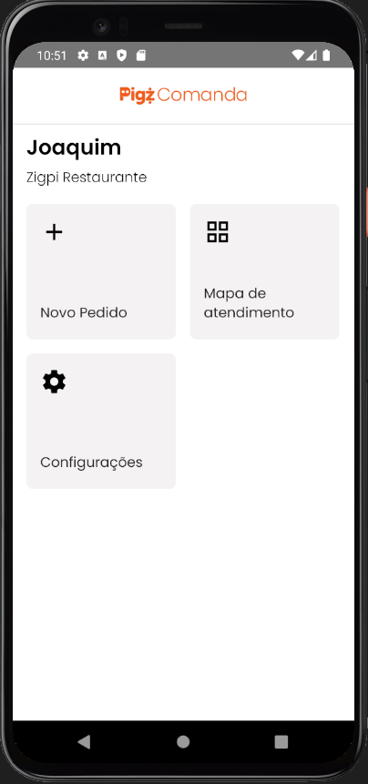
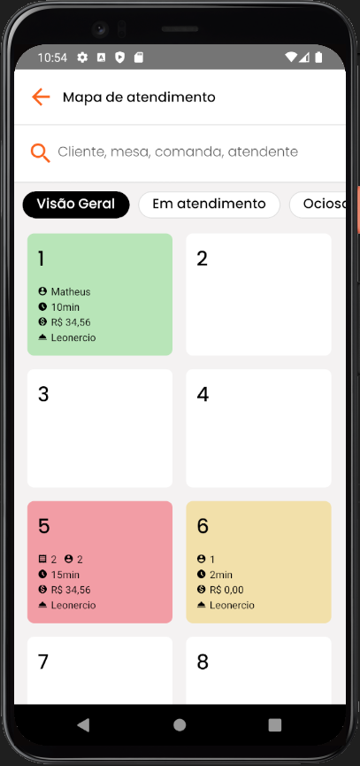
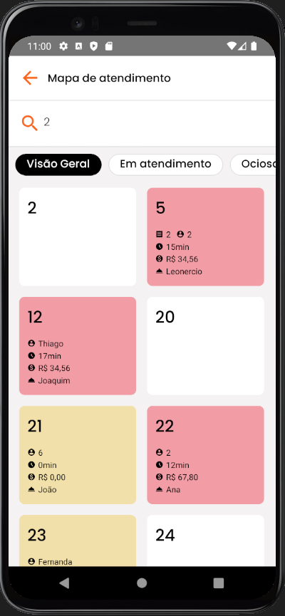
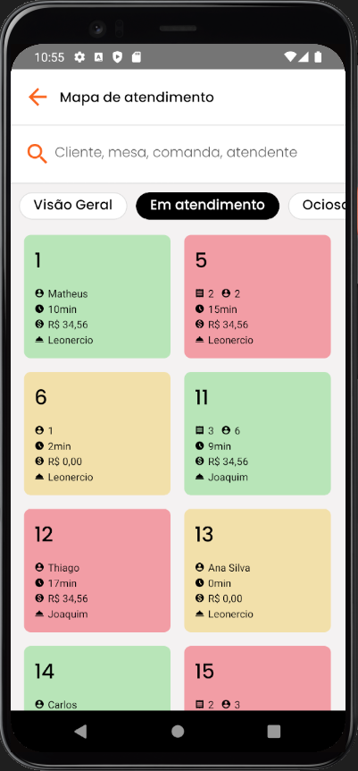
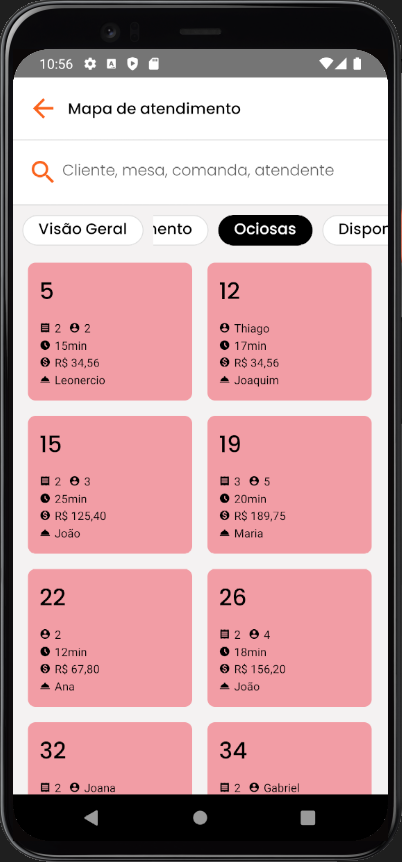
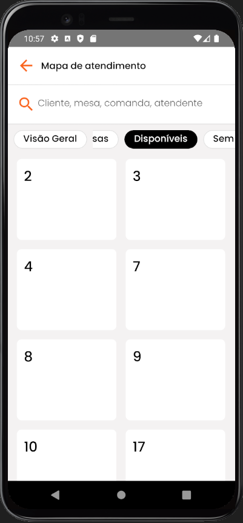
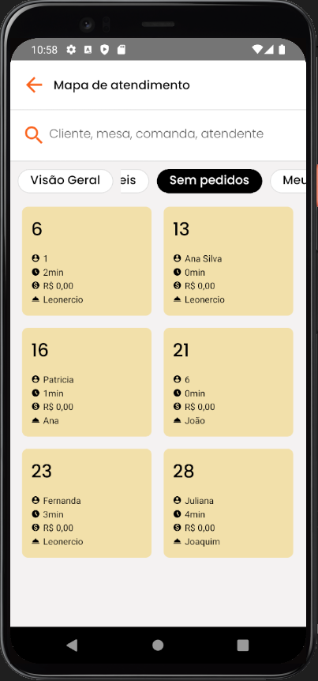
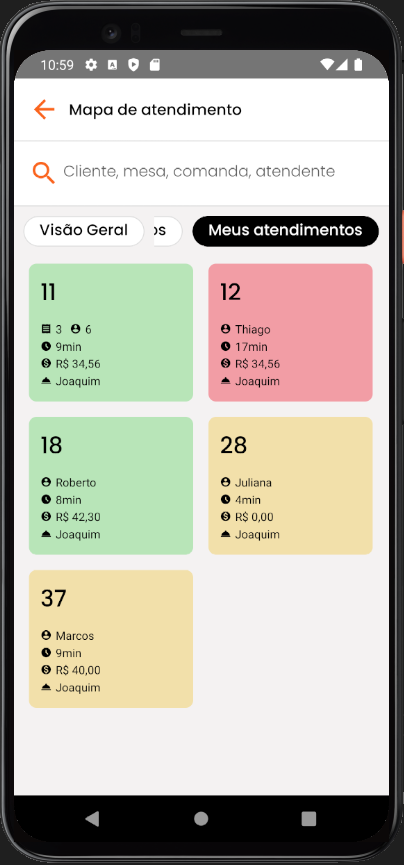

# 🍽️ Mapa de Atendimento de Mesas

## 📋 Visão Geral do Projeto

Aplicativo mobile desenvolvido com **React Native** e **TypeScript**, voltado para a **gestão visual de mesas em atendimento** em um restaurante ou lanchonete. Permite a visualização em tempo real do status de cada mesa, cliente, pedidos, valores totais e atendentes, com navegação fluida e interface moderna.

### ✅ Funcionalidades Principais

- 🪑 Visualização do status das mesas (ocupada, livre, etc.)
- 👥 Exibição de cliente, atendente, comandas e número de pessoas
- 💵 Valor total e tempo da mesa em aberto
- 🧾 Modal de criação de novo pedido
- 🔁 Atualização de dados via Redux + persistência local
- 🎨 Interface com design leve e responsivo

---

## 🚀 Instalação e Execução

### 🔧 Pré-requisitos

- Node.js **18+**
- Android Studio ou Xcode configurado
- Dispositivo Android físico **ou** emulador Android configurado
- `json-server` instalado globalmente ou via `npx`

### ⚙️ Passos para rodar o projeto

```bash
# 1. Clone o repositório
git clone https://github.com/G4briel25/MyApp.git

# 2. Acesse a pasta do projeto
cd MyApp

# 3. Instale as dependências
npm install --legacy-peer-deps
```

### ▶️ Executar o app

```bash
# Inicie o bundler
npm start

# Em outro terminal, execute no Android
npm run android
```

---

## 💡 API Local (JSON Server)

Inicie o JSON Server para simular os dados:

```bash
json-server --watch db.json --port 3000
```

> A API estará disponível por padrão em:  
> **http://localhost:3000/mesas**

---

## 🌐 Configuração de IP para a API

### Você deve ajustar o IP no arquivo `mesaService.ts`, de acordo com onde está rodando o app:

```ts
const LOCAL_IP = '192.168.x.x'; // IP da sua máquina

// Emulador Android Studio: use 10.0.2.2
// Dispositivo físico via USB: use seu IP local
const API_MESA_URL = `http://${LOCAL_IP}:3000/mesas?_page=${page}&_per_page=${perPage}`;
```

### 🧠 Importante:

| Ambiente                    | IP a ser usado                            |
|-----------------------------|-------------------------------------------|
| Emulador Android (AVD)      | `http://10.0.2.2:3000`                     |
| Dispositivo via USB (real)  | `http://<SEU_IP_LOCAL>:3000`              |

Você pode descobrir seu IP local com:

```bash
ipconfig  # Windows
ifconfig  # Linux/macOS
```
---

## 🛠️ Stack Tecnológica

- **React Native 0.80.1**
- **TypeScript**
- **Redux Toolkit + Redux Persist**
- **React Navigation (Stack, Tabs, Drawer)**
- **Styled-components**
- **Axios**
- **JSON Server**

---

## 📁 Estrutura do Projeto

```
assets/
└── fonts/                # Fontes personalizadas (Poppins)

src/
├── components/           # Componentes reutilizáveis
│   ├── CardMesa/
│   ├── CardsHome/
│   ├── HeaderGlobal/
│   ├── MesaIcone/
│   ├── PigzLogo/
│   ├── ShoppingBagSpeed/
│   └── TipoPedido/
├── hooks/                # Hooks personalizados
├── redux/                # Slices e store do Redux
│   └── slices/
├── services/             # Integração com a API (mesaService.ts)
├── styles/               # Estilos globais e componentes
├── types/                # Tipagens TypeScript
├── utils/                # Funções auxiliares
└── views/                # Telas principais
    ├── home/
    ├── mapa-atendimento/
    └── modal-novo-pedido/

db.json                  # Dados mockados do JSON Server
```

---

## 📦 Scripts Disponíveis

```bash
npm start             # Inicia o Metro Bundler
npm run android       # Executa no Android
npm run json-server   # Inicia o JSON Server na porta 3000
```

---

## 🌍 Ambiente Padrão

| Serviço        | URL                             |
|----------------|----------------------------------|
| JSON Server    | http://localhost:3000/mesas     |
| API para app   | http://10.0.2.2:3000 (AVD)       |
| API via USB    | http://192.168.x.x:3000 (real)  |

---

# 📸 Screenshots

## Tela inicial

## Modal de novo pedido

## Mapa de atendimento



# Filtros

## Filtros de pesquisa


## Em atendimento


## Ociosas


## Disponíveis


## Sem pedidos


## Meus atendimentos



---

## 👨‍💻 Autor

Desenvolvido por **Gabriel Jaune** — para um desafio técnico frontend.

---
